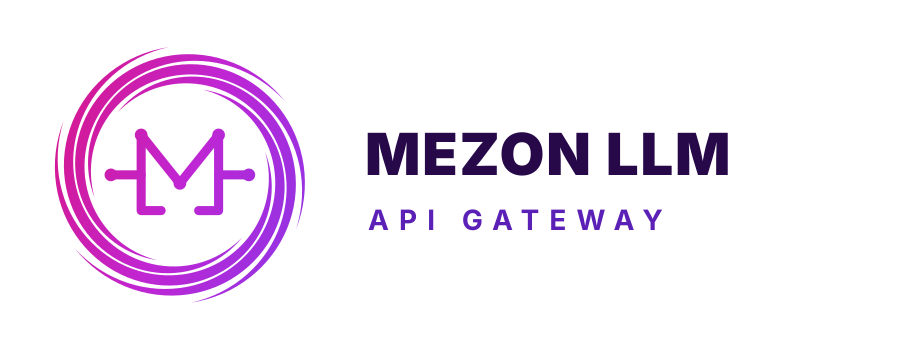

<p align="center">
  
</p>

<h1 align="center">Mezon LLM Portal</h1>

<p align="center">
  Customer Portal cho <a href="https://llm.mrdnd.dev">Mezon LLM</a> — quản lý API key, theo dõi sử dụng, và truy cập các mô hình AI hàng đầu.
</p>

<p align="center">
  <a href="https://github.com/dnd288/mezon-llm-portal/actions"></a>
  
  
  
</p>

---

## Tính năng

| Tính năng | Mô tả |
|---|---|
| **Trang chủ** | Giới thiệu sản phẩm, quick start code snippet, danh sách tool tương thích |
| **Xác thực Mezon OAuth 2.0** | Đăng nhập bằng tài khoản Mezon, tự đồng bộ user với backend |
| **Dashboard** | Số dư quota, thống kê sử dụng, nhập voucher, hướng dẫn cài đặt cho Claude Code / OpenCode / OMP / Cursor / Hermes |
| **Quản lý API Key** | Tạo / xem / thu hồi API key (`sk-...`), hiển thị key một lần duy nhất với nút Copy |
| **Bảng giá Model** | Tìm kiếm model theo tên, trạng thái sức khỏe (Ổn định / Chập chờn / Lỗi), giá mzđ / 1M token, nhóm truy cập |
| **Lịch sử sử dụng** | Bảng log chi tiết: model, key, token in/out, fee, total time |
| **Voucher** | Nhập voucher nạp quota, xem lịch sử nạp (từ log backend) |

## Tech Stack

- **Framework:** [Next.js 16](https://nextjs.org) (App Router, Server Components)
- **Language:** TypeScript 5
- **Styling:** [Tailwind CSS v4](https://tailwindcss.com) + [shadcn/ui v5](https://ui.shadcn.com)
- **Auth:** Mezon OAuth 2.0 + JWT session (httpOnly cookie)
- **Backend:** [mezon-llm](https://github.com/dnd288/mezon-llm) (new-api) — Go REST API
- **Package manager:** [Bun](https://bun.sh)
- **Dev methodology:** [agent-kit](https://github.com/dnd288/agent-kit) (18 skills, OpenSpec, CI)

## Quick Start

### 1. Clone & install

```bash
git clone https://github.com/dnd288/mezon-llm-portal.git
cd mezon-llm-portal
bun install
```

### 2. Cấu hình environment

```bash
cp .env.example .env.local
```

Điền các giá trị cần thiết (đầy đủ trong `.env.example`):

| Biến | Mô tả |
|---|---|
| `MEZON_CLIENT_ID` | Client ID từ [Mezon Developer Portal](https://mezon.ai/developers/applications) |
| `MEZON_CLIENT_SECRET` | Client Secret |
| `MEZON_REDIRECT_URI` | `http://localhost:3000/api/auth/callback` |
| `MEZON_AUTH_URL` | OAuth authorize endpoint (mặc định: `https://oauth2.mezon.ai/oauth2/auth`) |
| `MEZON_TOKEN_URL` | OAuth token endpoint (mặc định: `https://oauth2.mezon.ai/oauth2/token`) |
| `MEZON_USERINFO_URL` | OAuth userinfo endpoint (mặc định: `https://oauth2.mezon.ai/userinfo`) |
| `NEW_API_BASE_URL` | URL backend mezon-llm (mặc định: `https://llm.mrdnd.dev`) |
| `NEW_API_ADMIN_TOKEN` | Admin token để đồng bộ user |
| `JWT_SECRET` | Chuỗi ngẫu nhiên 64 ký tự cho JWT session |
| `SESSION_MAX_AGE` | Thời gian sống session, giây (mặc định: `86400`) |
| `NEXT_PUBLIC_APP_URL` | URL gốc của portal (mặc định: `http://localhost:3000`) |
| `NEXT_PUBLIC_APP_NAME` | Tên hiển thị của sản phẩm (mặc định: `Mezon LLM`) |

### 3. Chạy dev server

```bash
bun run dev
```

Mở [http://localhost:3000](http://localhost:3000).

## Scripts

```bash
bun run dev              # Dev server (Turbopack)
bun run build            # Production build
bun run start            # Start production server
bun run typecheck        # TypeScript check
bun run lint             # ESLint
bun run validate         # Typecheck + lint
```

## Cấu trúc dự án

```
src/
├── app/
│   ├── layout.tsx                  # Root layout
│   ├── page.tsx                    # Trang chủ (public)
│   ├── login/page.tsx              # Đăng nhập Mezon OAuth
│   ├── models/page.tsx             # Bảng giá model (public)
│   ├── (portal)/                   # Layout cho user đã đăng nhập
│   │   ├── layout.tsx              # Sidebar + header
│   │   ├── dashboard/page.tsx      # Dashboard
│   │   ├── tokens/page.tsx         # Quản lý API Key
│   │   ├── logs/page.tsx           # Lịch sử sử dụng
│   │   └── vouchers/page.tsx       # Voucher + lịch sử nạp từ logs
│   └── api/
│       ├── auth/                   # Mezon OAuth routes (login, callback, session, logout)
│       └── portal/                 # Backend proxy routes (tokens, logs, voucher, stats)
├── components/
│   ├── ui/                         # shadcn/ui components
│   ├── page-header.tsx             # Header chung cho portal pages
│   ├── usage-stats.tsx             # Dashboard stats filter (hôm nay/tuần/tháng/toàn bộ)
│   ├── portal-nav.tsx              # Sidebar navigation
│   ├── create-token-dialog.tsx     # Dialog tạo API key
│   ├── voucher-dialog.tsx          # Dialog nhập voucher
│   ├── delete-token-button.tsx     # Nút thu hồi API key
│   └── mobile-nav.tsx              # Nav responsive
├── lib/
│   ├── api.ts                      # Client gọi mezon-llm backend
│   ├── auth.ts                     # JWT session management
│   └── quota.ts                    # Format helpers
└── middleware.ts                   # Route protection
```

## OAuth Flow

```
User ──▶ /login ──▶ /api/auth/login ──▶ Mezon OAuth
                                              │
  /dashboard ◀── set cookie ◀── /api/auth/callback
                                    │
                              exchange code ──▶ Mezon Token API
                              get userinfo ──▶ Mezon Userinfo API
                              sync user    ──▶ mezon-llm (new-api)
                              create JWT session
```

## Deployment

### Cloudflare Pages

```bash
bun run build
# Deploy thư mục .next/ lên Cloudflare Pages
```

### Docker

```dockerfile
FROM oven/bun:1 AS builder
WORKDIR /app
COPY package.json bun.lock ./
RUN bun install --frozen-lockfile
COPY . .
RUN bun run build

FROM oven/bun:1-slim
WORKDIR /app
COPY --from=builder /app/.next ./.next
COPY --from=builder /app/public ./public
COPY --from=builder /app/package.json ./
COPY --from=builder /app/node_modules ./node_modules
EXPOSE 3000
CMD ["bun", "run", "start"]
```

## Project documentation

- [`docs/README.md`](docs/README.md) — Documentation index
- [`docs/product/prd.md`](docs/product/prd.md) — Product requirements and accepted scope
- [`docs/product/open-questions.md`](docs/product/open-questions.md) — Open questions that gate changes
- [`docs/engineering/architecture.md`](docs/engineering/architecture.md) — Architecture and data-flow boundaries
- [`docs/engineering/authentication.md`](docs/engineering/authentication.md) — Mezon OAuth and session model
- [`docs/engineering/backend-api.md`](docs/engineering/backend-api.md) — new-api boundary and portal proxy routes
- [`docs/engineering/testing.md`](docs/engineering/testing.md) — Validation and test-stack status
- [`docs/adr/`](docs/adr/) — Architecture decisions

## Agent Kit

Dự án sử dụng [agent-kit](https://github.com/dnd288/agent-kit) với prefix `mlp`. Xem:

- [`AGENTS.md`](AGENTS.md) — Quy tắc và boundaries cho coding agents
- [`CONTEXT.md`](CONTEXT.md) — Glossary các thuật ngữ trong dự án
- [`CONTRIBUTING.md`](CONTRIBUTING.md) — Hướng dẫn đóng góp
- [`.agents/skills/`](.agents/skills/) — 18 methodology skills
- [`openspec/`](openspec/) — Specification schemas

## License

MIT
